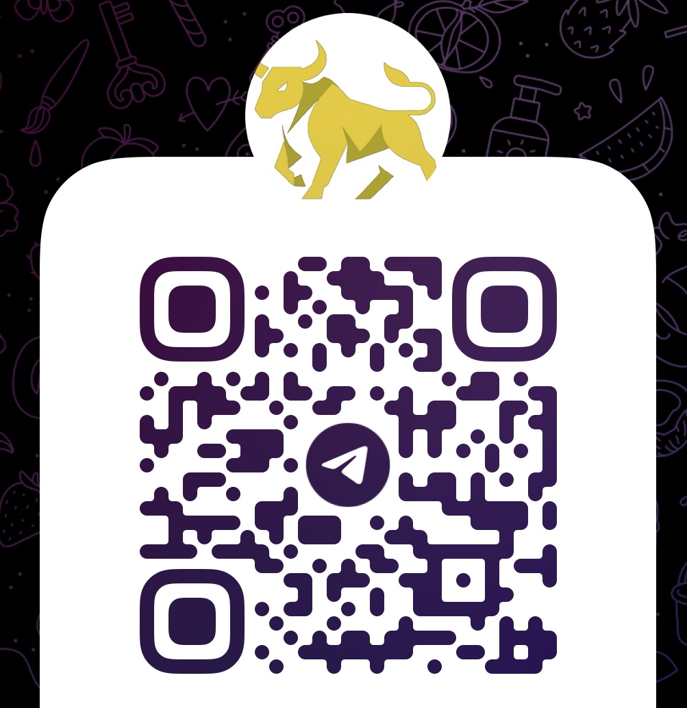

  

    <h2>每日三分鐘，掌握全球股市脈動</h2>
    
我們每日精選最新股市動態，為您快速整理關鍵價量資訊與市場焦點，讓您用最短的時間，洞悉趨勢，做出最佳決策。

  

  

    
  

  <h3>加入我們的 Telegram</h3>
  
掃描 QR Code 或點擊按鈕，即時獲取最新資訊！

  
   
  <a href="https://t.me/USStockFuntBot" class="cta-button" target="_blank" rel="noopener noreferrer">
    立即加入
  </a>

